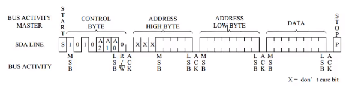
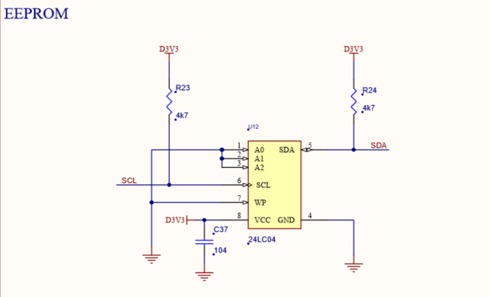
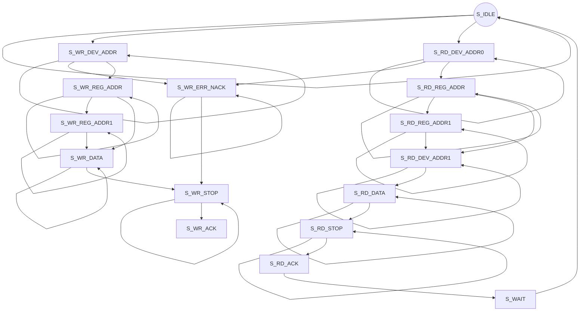
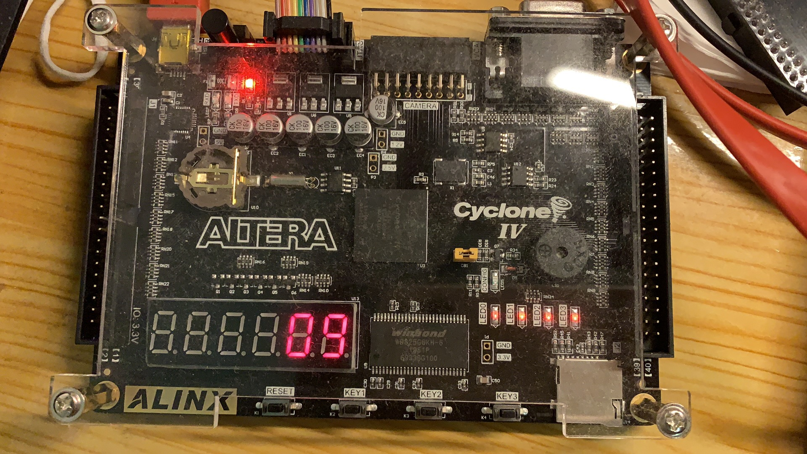

## Logbook W2

### 1.Least Mean Square Algorithm

The LMS algorithm is a class of adaptive filter used to mimic a desired filter by adjusting the filter coefficients in such a way that it produces the least mean square of the error signal. And the error signal in this case is the difference between the desired and actual signal. 
                                                            

- y(n) is the output of the adaptive filter, which generates anti-noise or reduced noise
- e(n) is the estimated error obtained by subtracting the anti-noise from the contaminated signal. This is essentially the final reduced-noise output of the system
- x(n) is the reference signal, which represents the pure noise signal
- d(n) is the contaminated input signal

The LMS algorithm is based on the following equations:

1. 
   $$
   y(n) = u^T W
   $$
   W = vector of weights applied to the filter coefficients

   T = transpose operation

   2.
$$
Estimated \quad Error = e(n) = d(n) - y(n)
$$
   3.
$$
Weight \quad Update: W(n + 1)=W(n)+2*μ*e(n)*x(n)
$$
μ is the step size and is inversely proportional to the settling time constant of the convergence behavior. For smaller values of step size, the adaptive process slows down but the mean-square error is minimized(longer time but better results). And the value of μ  should be scientifically computed on the basis of the effects of the environment. In order to select appropriate step size and filter order (both can effectively determine the performance of LMS), MATLAB simulation of LMS algorithm is carried out. 


### 2.  EEPROM Read/Write Experiment (I2C interface)

#### 2.1 I2C bus protocol and timing

The I2C standard rate is 100kbit/s and the fast mode is 400kbit/s. It supports multi-machine communication and multi-master control module, but only one master control is allowed at the same time. The serial bus is composed of data line SDA and clock SCL. Each circuit and module has a unique address.

 The operation of I2C device can be divided into writing a single storage byte, writing multiple storage bytes, reading a single storage byte and reading multiple storage bytes. Each operation is shown in the figure below.

- Figure 1: Write a single byte


- Figure 2: Write multiple bytes

  

- Figure 3: Read a single byte

  , which is defined as the start signal of I2C bus, which marks the beginning of a data transmission. The starting signal is actively established by the master controller, and the I2C bus must be idle before the signal is established, as shown in the figure below.

   - **Stop signal:** During the time the clock line SCL remains high, the data line SDA is released, causing THE SDA to return high (i.e. positive hop), known as the I2C bus stop signal, which marks the termination of a data transmission. The stop signal is also set up by the master controller. After setting up the signal, the I2C bus will return to the idle state.

​                                                            

3. Data  transmission

Each bit of data transmitted on the I2C bus has a corresponding clock pulse (or synchronous control), that is, in conjunction with the SCL serial time clock, each bit of data is transmitted sequentially bit by bit on the SDA. During data transmission, the level on the SDA must remain stable while the SCL is high, with the low level being data 0 and the high level being data 1.Level changes on the SDA are allowed only if the SCL is low.

4. ACK/NACK

All the data on the I2C bus is transmitted in 8-bit bytes. For each byte sent by the transmitter, the data line is released during the 9th phase of the clock pulse, and a reply signal is fed back by the receiver.When the response signal is low, it is specified as an effective response bit (ACK abbreviation as response bit), indicating that the receiver has successfully received the byte;

The response signal is a high level signal, specified as a non-response bit (NACK), generally indicating that the receiver failed to receive the byte.The requirement for an effective feedback ACK is for the receiver to pull the SDA line down during the low level before the 9th clock pulse and to ensure that it is stable low during the high level of the clock.

If the receiver is the master, after it receives the last byte, it sends an NACK signal to notify the controlled sender to end the data transmission, and releases the SDA line so that the master receiver sends a stop signal.

#### 2.2 Program Design

##### Schematic of EEPROM



FPGA chip connects EEPROM 24LC04 through I2C bus, and the two buses of I2C pull up a 4.7K resistor to 3.3V, so when there is no output on the bus, it will be pulled up. Since A0~A2 are low on the circuit, the device address of 24LC04 is 0xA0.

##### State Machine

top module state machine definition:

```
localparam S_IDLE             =  0;             // Idle state, waiting for read and write
localparam S_WR_DEV_ADDR      =  1;             // Write device address
localparam S_WR_REG_ADDR      =  2;             // Write register address 
localparam S_WR_DATA          =  3;             // Write register data
localparam S_WR_ACK           =  4;             // Write request response
localparam S_WR_ERR_NACK      =  5;             // Write error, I2C device is not responding
localparam S_RD_DEV_ADDR0     =  6;             // I2C read state, first writes the device address and the register address
localparam S_RD_REG_ADDR      =  7;             // I2C read state, read register address (8bit)
localparam S_RD_DEV_ADDR1     =  8;             // Write the device address again
localparam S_RD_DATA          =  9;             // Read data
localparam S_RD_STOP          = 10;  
localparam S_WR_STOP          = 11; 
localparam S_WAIT             = 12; 
localparam S_WR_REG_ADDR1     = 13; 
localparam S_RD_REG_ADDR1     = 14; 
localparam S_RD_ACK           = 15; 
```




#### 2.3 Experiment Result



Number '09' is stored in the device address of EEPROM and it can be read from I2C bus, then display this number on digital display.

### 3. SignalTap II Logic Analyzer