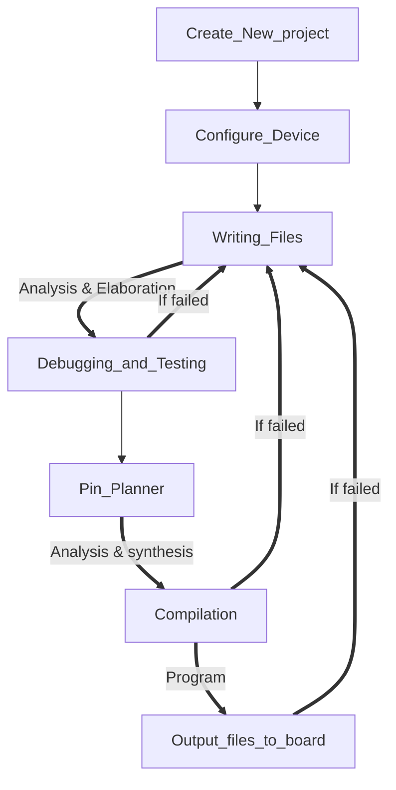

#                                        Project Report for W1

## 1.Learning Basic Operation of Quartus II 



## 2. Testbench and Modelsim SE

- Writing Testbench

- Create modelsim project

- Analyze the testbench file and check the wave

- System assignments and system function

  ```
  $display //print information
  $write
  $monitor //monitor variables
  $strobe
  $stop // stop the simulation
  $finish 
  $time/$stime/$realtime
  $random
  $reaadmemb //read data from files
  
  ```

  

## 3. Learning Verilog HDL (Basic part)

### 3.1.  Types of Data object 

| Data object |                            Define                            |
| :---------: | :----------------------------------------------------------: |
|     net     | net_type [signed] [vectored\|scalared] list_of _indentifiers |
|     reg     |   reg [signed] [vectored\|scalared] list_of _indentifiers    |
| reg_memory  |            reg [msb1:lsb1]  memory [msb2 : lsb2]             |
|   integer   |              integer idata / integer iram [n:0]              |
|    time     |                 time idata / time iram [n:0]                 |
|    real     |                          real idata                          |
|  parameter  |            parameter IDENTIFIERS = integer number            |
|   string    |                        reg [n: 1] str                        |

### 3.2  Basic Operators

|       Operator       |          Example          |
| :------------------: | :-----------------------: |
| assignment operator  |          <= , =           |
| arithmetic operator  |  + , - , * , / , % , **   |
|   logical operator   |        && ,\|\|, !        |
| relational operator  |      > , <,  >= , <=      |
|   bitwise operator   |  & , \| , ^ , ~^, ^~ , ~  |
|    shift operator    |    << , >> , <<< , >>>    |
| conditional operator |            ?:             |
|  reduction operator  | & , \| ，~& , ~\| , ^, ~^ |

### 3.3  Concurrent statements and Sequential statements

#### 3.3.1 Concurrent statements

- Continuous Assignments

- Module Instance

- Initial

  ```
  format:
  initial
  begin
    [sequential control statement] sequential statement 1;
    [sequential control statement] sequential statement 2;
    ...
    [sequential control statement] sequential statement N;
  end
  ```

- Always

  ```
  format:
  always
  begin
    [sequential control statement] sequential statement 1;
    [sequential control statement] sequential statement 2;
    ...
    [sequential control statement] sequential statement N;
  end
  ```

------

#### 3.3.2  Sequential statements

- Assignment statement

  ```
  Example 1:
  always @(posedge clk)
  begin
    s1=d1+d2; //assignment statement 1;
    s2=d2+d3; //assignment statement 2;
    s3=d3+d4; //assignment statement 3; 
    ...
    //assignment statement N;
  end
  ```

- If statement

  ```
  Example 2:
  always @(posedge clk)
  begin
    if(case 1)
      s1 = d1 + d2; // if statement
    else
      s1 = d1 + d3; // if statement
  end
  ```

- Case statement

  ```
  Example 3:
  always @(posedge clk)
  begin
    case(case 1)
      case statement 1:
         sequential statement 1;
      case statement 2:
         sequential statement 1;
      ...
      case statment N-1:
         sequential statement N-1;
      default:
         sequential statement N;
    endcase
  end
  ```

- Loop statement

  1. for

  2. repeat

     ```
     format:
     repeat(N)
       sequential statements; //statements will be operated for N times
     ```

  3. while

  4. forever

     ```
     format:
     forever
       sequential statements; //statements will be operated forever
     ```

     

## 4. The development process of FPGA project design

### 4.1 Introduction of Active Noise Cancellation(ANC)

Active noise cancellation (ANC) is the process of using a microphone to monitor environmental noise and creating anti-noise that’s then mixed in with audio playback to cancel noise entering the user’s ear. Following figure is the basic scheme for the ANC:


The aim is to minimize the noise interference1 that corrupts the original input signal. In the figure above, the desired signal d(n) is composed by an unknown signal s(n) and an additional noise n2(n), generated for the interference. The adaptive filter is then installed in a place that the only input is the interference signal n1(n). The signals n1(n) and n2(n) are correlated. The output of the filter y(n) is compared with the desired signal d(n), generating an error e(n). That error, which is the system output, is used to adjust the variable weights of the adaptive filter in order to minimize the noise interference. In an optimal situation, the output of the system e(n) is composed by the signal s(n), free of the noise interference n2(n) .

### 4.2 Adaptive filter algorithm (Still learning) 

Learning different ANC algorithm and find a suitable one for the design:

- Least mean squares(LMS) algorithms : Try to reduce the mean square error.
- Normalized LMS (NLMS) algorithms : Used when the size of primary signal is large.
- Recursive Least squares (RLS) algorithms

### 4.3 Using Matlab to design the digital filter (future plan)

### 4.4 Realized functions using Altera FPGA board (Cyclone IV EP4CE6F17C8)

#### 1. Audio record and play

The voice data input by the microphone will be stored in the SDRAM memory through the audio module, and then the audio data will be sent to the audio module to play the voice from the headphone interface, so as to realize the function of recording and playing.

- Using audio module AN831(with audio codec chip WM8731)

  5 pins of WM8731: 

  input signal pins : BCLK, DACDAT, DACLRC, ADCLRC

  output signal pins : ADCDAT

  Data is transmitted at  negative edge of each clock period.

- Using I2C bus to configure the registers in chip WM8731 (WM8731 is  the master device and FPGA board is the slave device)

  1. audio receive module: Receive the audio signal input from the microphone, complete the audio reception of the left and right channels, and convert the serial data into parallel data.
  2. audio transmit module:   Complete the serialization of audio data of left and right channels.

- Digital audio interface mode : Right justified mode

#### 2. 7 Segment Digital Display

- Each LED digital display is divided by 7 segments: a,b,c,d,e,f,g , and it can display 16 different numbers and characters: from 1 to letter F 

  ```
  module seg_decoder
  (
  	input[3:0]      bin_data,     // bin data input
  	output reg[6:0] seg_led      // seven segments LED output
  );
  
  always@(*)
  begin
  	case(bin_data)
  		4'd0:seg_led <= 7'b100_0000; //display "0"
  		4'd1:seg_led <= 7'b111_1001; //display "1"
  		4'd2:seg_led <= 7'b010_0100; //display "2"
  		4'd3:seg_led <= 7'b011_0000; //display "3"
  		4'd4:seg_led <= 7'b001_1001; ...
  		4'd5:seg_led <= 7'b001_0010;
  		4'd6:seg_led <= 7'b000_0010;
  		4'd7:seg_led <= 7'b111_1000;
  		4'd8:seg_led <= 7'b000_0000;
  		4'd9:seg_led <= 7'b001_0000;
  		4'ha:seg_led <= 7'b000_1000; //display "a"
  		4'hb:seg_led <= 7'b000_0011; //display "b"
  		4'hc:seg_led <= 7'b100_0110; ...
  		4'hd:seg_led <= 7'b010_0001;
  		4'he:seg_led <= 7'b000_0110;
  		4'hf:seg_led <= 7'b000_1110;
  		default:seg_led <= 7'b111_1111;
  	endcase
  end
  endmodule
  ```


- Scan the signal to select needed LED digital display 
- Result display : 

#### 3. Volume control

The volume of the output audio can be changed by changing the I2C register data

